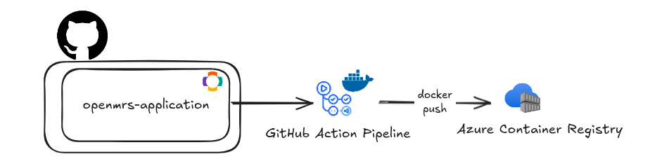

# Docker & Conteneurisation

Ce projet fournit des images Docker prêtes à l’emploi pour déployer l’application OpenMRS 3.x Reference Application.

## Images disponibles

Le dépôt [openmrs-distro-referenceapplication](https://github.com/AudioProthese/openmrs-distro-referenceapplication) construit et publie plusieurs images :

- **backend** : le backend OpenMRS (Java, Tomcat)
- **frontend** : l’interface utilisateur 3.x (Nginx + SPA)
- **gateway** : un proxy Nginx pour unifier l’accès frontend/backend

## Construction locale

Pour construire les images localement :

```sh
docker compose build
```

## Lancement de la stack

Pour démarrer l’ensemble des services :

```sh
docker compose up
```

- L’interface OpenMRS 3.x est accessible sur [http://localhost/openmrs/spa](http://localhost/openmrs/spa)
- L’interface Legacy UI est accessible sur [http://localhost/openmrs](http://localhost/openmrs)

## Structure des fichiers

- [`Dockerfile`](https://github.com/AudioProthese/openmrs-distro-referenceapplication/blob/main/Dockerfile) : construction du backend
- [`frontend/Dockerfile`](https://github.com/AudioProthese/openmrs-distro-referenceapplication/blob/main/frontend/Dockerfile) : construction du frontend
- [`gateway/Dockerfile`](https://github.com/AudioProthese/openmrs-distro-referenceapplication/blob/main/frontend/Dockerfile) : construction de la gateway
- [`docker-compose.yml`](https://github.com/AudioProthese/openmrs-distro-referenceapplication/blob/main/docker-compose.yml) : orchestration multi-conteneurs

## Personnalisation

- Les variables d’environnement (ex : base de données, configuration OpenMRS) sont définies dans le fichier [`docker-compose.yml`](https://github.com/AudioProthese/openmrs-distro-referenceapplication/blob/main/docker-compose.yml).
- Les modules et la configuration sont injectés automatiquement lors du build via le dossier `distro/`.

## Publication des images

Les images sont construites et publiées automatiquement via GitHub Actions dans un registre Azure Container Registry (ACR).



---

*Documentation maintenue par l’équipe DevOps – Projet AudioProthèse+*