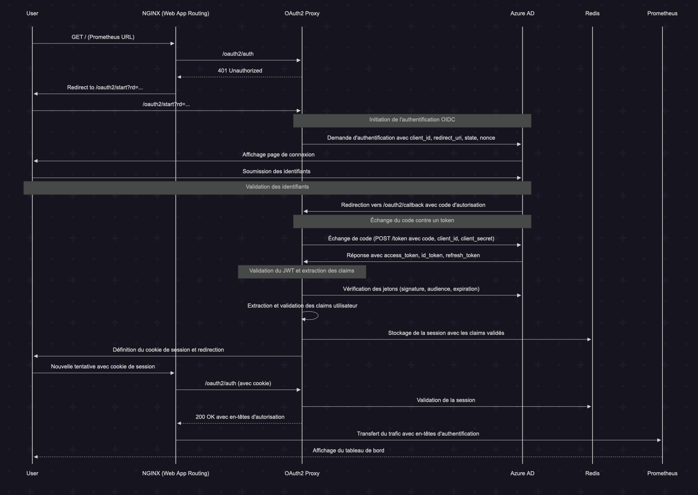
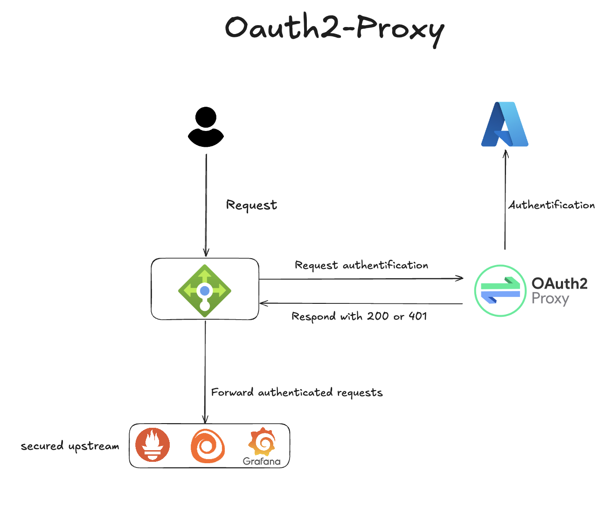

# Authentification (OAuth2-Proxy)

## Vue d'ensemble

Nous avons mis en place OAuth2-Proxy comme passerelle d'authentification centralisée pour sécuriser l'accès à toutes nos applications de surveillance et opérationnelles. Cette configuration garantit que seuls les utilisateurs autorisés appartenant à notre tenant Microsoft Entra ID (Azure AD) peuvent accéder à ces systèmes critiques.

## Architecture

OAuth2-Proxy agit comme un proxy inverse qui se place devant nos applications et gère l'authentification avant d'autoriser l'accès aux services backend. Toutes les applications sont protégées derrière cette couche d'authentification.

### Applications protégées

Les applications suivantes sont sécurisées avec OAuth2-Proxy :

- **Prometheus** (`prometheus.dev.audioprothese.ovh`) - Collecte de métriques et surveillance
- **Grafana** (`grafana.dev.audioprothese.ovh`) - Tableaux de bord d'observabilité et visualisation
- **Alloy** (`alloy.dev.audioprothese.ovh`) - Collecte et transfert de logs
- **AlertManager** (`alertmanager.dev.audioprothese.ovh`) - Gestion et routage des alertes
- **ArgoCD** (quand activé) - Gestion de déploiement GitOps

## Flux d'authentification

1. **Accès utilisateur** : L'utilisateur tente d'accéder à une application protégée
2. **Vérification d'authentification** : OAuth2-Proxy vérifie si l'utilisateur a une authentification valide
3. **Redirection vers Microsoft** : Si non authentifié, l'utilisateur est redirigé vers la connexion Microsoft Entra ID
4. **Autorisation** : Microsoft Entra ID valide les identifiants de l'utilisateur et l'appartenance au tenant
5. **Callback** : Après authentification réussie, l'utilisateur est redirigé vers OAuth2-Proxy
6. **Accès accordé** : OAuth2-Proxy valide le token et accorde l'accès à l'application demandée




## Détails de configuration

### Intégration Microsoft Entra ID

```yaml
Provider: OIDC (OpenID Connect)
Issuer URL: https://login.microsoftonline.com/8a25df97-9f2b-4ef1-a9e7-3faf585640e8/v2.0
Tenant ID: 8a25df97-9f2b-4ef1-a9e7-3faf585640e8
Scopes: openid email profile
Email Claim: preferred_username
```

### Fonctionnalités de sécurité

- **Sécurité des cookies** : Cookies sécurisés avec restriction de domaine (`.audioprothese.ovh`)
- **Gestion des sessions** : Stockage de session basé sur Redis pour la scalabilité
- **Actualisation des tokens** : Actualisation automatique des tokens toutes les 2 minutes
- **Expiration de session** : Expiration de session après 24 heures
- **Restriction de domaine** : Accès limité aux domaines `*.audioprothese.ovh`

### Annotations Ingress

Toutes les applications protégées utilisent ces annotations standard :

```yaml
nginx.ingress.kubernetes.io/auth-url: "https://oauth2.dev.audioprothese.ovh/oauth2/auth"
nginx.ingress.kubernetes.io/auth-signin: "https://oauth2.dev.audioprothese.ovh/oauth2/start?rd=$scheme://$host$escaped_request_uri"
```

Pour les applications nécessitant des informations utilisateur (comme Grafana) :
```yaml
nginx.ingress.kubernetes.io/auth-response-headers: X-Auth-Request-User, X-Auth-Request-Email
```

## Contrôle d'accès

### Utilisateurs autorisés
- Seuls les utilisateurs appartenant au tenant Microsoft Entra ID `8a25df97-9f2b-4ef1-a9e7-3faf585640e8`
- Aucune restriction spécifique de domaine email (email-domain=*)
- Provisioning automatique des utilisateurs activé pour les applications supportées

### Gestion des sessions
- **Stockage de session** : Cluster Redis pour haute disponibilité
- **Durée de session** : 24 heures
- **Intervalle d'actualisation** : 2 minutes
- **Domaine de cookie** : `.audioprothese.ovh` (permet l'accès cross-subdomain)

## Instructions d'utilisation

### Pour les utilisateurs finaux

1. **Navigation** vers l'URL d'une application protégée (ex: `https://grafana.dev.audioprothese.ovh`)
2. **Redirection d'authentification** : Vous serez automatiquement redirigé vers la connexion Microsoft
3. **Connexion** : Utilisez vos identifiants de compte Microsoft organisationnel
4. **Accès accordé** : Après authentification réussie, vous serez redirigé vers l'application demandée

### Gestion des sessions

- **Actualisation automatique** : Les sessions sont automatiquement actualisées lors de l'utilisation active des applications
- **Accès cross-application** : Une fois authentifié, vous pouvez accéder à toutes les applications protégées sans re-authentification
- **Déconnexion** : Les sessions expirent après 24 heures d'inactivité

## Dépannage

### Problèmes courants

1. **Boucle d'authentification** : Effacer les cookies du navigateur pour le domaine `.audioprothese.ovh`
2. **Accès refusé** : S'assurer que votre compte appartient au bon tenant Microsoft
3. **Session expirée** : Se re-authentifier en accédant à n'importe quelle application protégée

### Logs et surveillance

Les logs OAuth2-Proxy sont disponibles via :
- **Grafana** : Tableau de bord des logs d'application
- **Alloy** : Collecte centralisée de logs
- **Prometheus** : Métriques d'authentification et taux de succès

## Considérations de sécurité

- **Isolation de tenant** : Seuls les utilisateurs du tenant Microsoft spécifique peuvent s'authentifier
- **Transport sécurisé** : Toute communication utilise HTTPS avec chiffrement TLS
- **Sécurité de session** : Sessions stockées dans Redis avec expiration appropriée
- **Aucune exposition backend** : Les applications backend ne sont pas directement accessibles sans authentification
- **Actualisation régulière des tokens** : Minimise le temps d'exposition des tokens d'accès

## Maintenance

### Stockage de session Redis
- **Haute disponibilité** : Configuration Redis maître-esclave
- **Sauvegarde** : Les données de session sont éphémères et gérées automatiquement
- **Surveillance** : Santé Redis surveillée via les métriques Prometheus

### Gestion des certificats
- **Renouvellement automatique** : Certificats Let's Encrypt auto-renouvelés via cert-manager
- **Couverture de domaine** : Certificats wildcard ou individuels pour tous les domaines protégés
- **Application HTTPS** : Tout le trafic automatiquement redirigé vers HTTPS