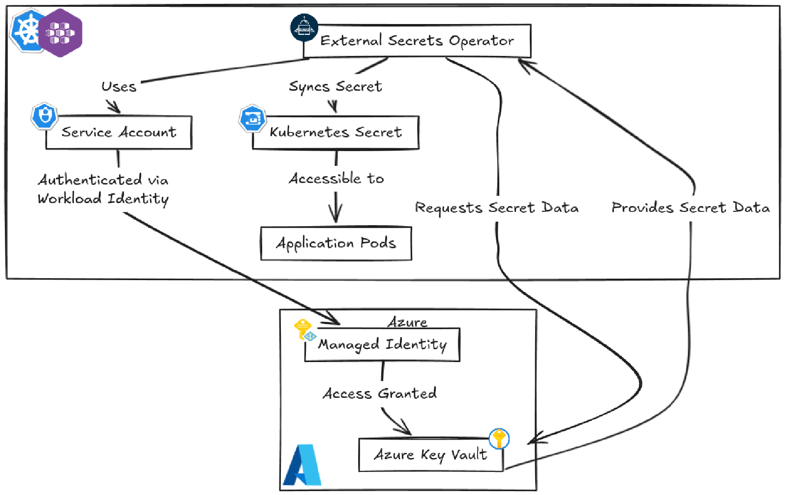
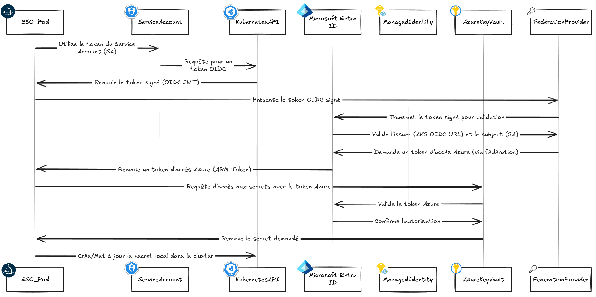
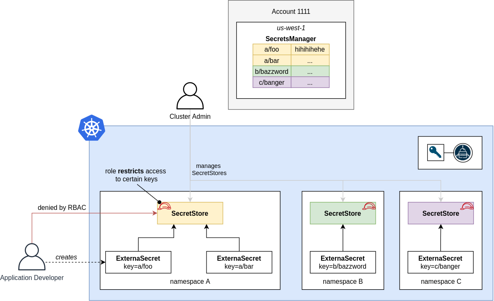

# Gestion des secrets

Azure Key Vault & External Secrets Operator

## Objectif

Ce projet intègre une gestion centralisée et sécurisée des secrets grâce à Azure Key Vault combiné à External Secrets Operator (ESO) dans Kubernetes.

Cette architecture permet de :
- Séparer la gestion des secrets de leur consommation
- Éviter le stockage de secrets dans les manifests ou Git
- Assurer une rotation et une gestion RBAC native via Azure
- Synchroniser automatiquement les secrets dans des objets `Secret` Kubernetes à partir d'Azure Key Vault

## Architecture



## Composants utilisés

| Composant                       | Rôle                                                              |
| ------------------------------- | ----------------------------------------------------------------- |
| Azure Key Vault                 | Stockage sécurisé des secrets au niveau cloud (RBAC activé)       |
| External Secrets Operator (ESO) | Outil qui synchronise automatiquement les secrets vers Kubernetes |
| Azure Workload Identity (OIDC)  | Authentifie le service Kubernetes sans stocker de secrets         |
| Kubernetes Secret               | Objet Kubernetes généré automatiquement par ESO                   |

## Configuration et implémentation

### Azure Key Vault

Le Key Vault est provisionné par Terraform avec :
- `enable_rbac_authorization = true`
- `soft_delete` et `purge_protection` activés (optionnel)

Création d’un secret via Azure CLI :

```bash
az keyvault secret set --vault-name <vault-name> --name "DB_PASSWORD" --value "super-secret"
```

### Authentification via Azure Workload Identity

ServiceAccount Kubernetes :

```yaml
apiVersion: v1
kind: ServiceAccount
metadata:
  annotations:
    azure.workload.identity/client-id: "${azurerm_kubernetes_cluster.aks.kubelet_identity[0].client_id}"
  name: workload-identity-sa
  namespace: authgate
```

Ressource Terraform associée :

```hcl
# OIDC AKS
resource "azurerm_federated_identity_credential" "ESOFederatedIdentity" {
  name                = "ESOFederatedIdentity"
  resource_group_name = azurerm_kubernetes_cluster.aks.node_resource_group
  audience            = ["api://AzureADTokenExchange"]
  issuer              = azurerm_kubernetes_cluster.aks.oidc_issuer_url
  parent_id           = azurerm_kubernetes_cluster.aks.kubelet_identity[0].user_assigned_identity_id
  subject             = "system:serviceaccount:authgate:workload-identity-sa"
}
```

Attribution du rôle sur le Key Vault :

```hcl
# Vault AKS User
resource "azurerm_role_assignment" "keyvault_secrets_user" {
  scope                            = azurerm_key_vault.vault.id
  role_definition_name             = "Key Vault Secrets User"
  principal_id                     = azurerm_kubernetes_cluster.aks.kubelet_identity[0].object_id
  skip_service_principal_aad_check = true
}
```

### Fonctionnement



### Synchronisation avec External Secrets Operator

#### SecretStore

```yaml
apiVersion: external-secrets.io/v1
kind: SecretStore
metadata:
  name: azure-secret-store
  namespace: authgate
spec:
  provider:
    azurekv:
      authType: WorkloadIdentity
      vaultUrl: ${azurerm_key_vault.vault.vault_uri}
      tenantId: ${azurerm_key_vault.vault.tenant_id}
      serviceAccountRef:
        name: workload-identity-sa
```

#### ExternalSecret

```yaml
apiVersion: external-secrets.io/v1
kind: ExternalSecret
metadata:
  name: <external-secret-name>
  namespace: authgate
spec:
  refreshPolicy: Periodic
  refreshInterval: 1h 
  secretStoreRef:
    name: azure-secret-store
    kind: SecretStore
  target:
    name: <secret-name-in-k8s>
  data:
  - secretKey: <secret-key-in-k8s>
    remoteRef:
      key: <secret-key-in-azure-key-vault>
```

Une fois appliqué, le secret Kubernetes est visible :

```bash
kubectl get secret <secret-name> -n <namespace> -o yaml
```

## Portée d'utilisation actuelle

Dans l'implémentation actuelle, Azure Key Vault est utilisé **uniquement pour la gestion des secrets dans le namespace `authgate`** via External Secrets Operator.

Cette intégration permet de sécuriser, centraliser et synchroniser les secrets sensibles (par exemple, credentials d’authentification ou tokens d’API) utilisés par les composants critiques exposés à l'extérieur.

## Extension multi-namespace possible

L’architecture mise en place peux être dupliquer pour les autres namespaces. En récréant les objets `ServiceAccout` `SecretStore` et `ExternalSecret` dans les namespaces cibles et en faisant une `Fédération` en le nouveau `ServiceAccount` et Azure, tout service peut tirer parti d’Azure Key Vault sans effort supplémentaire.

Ce modèle respecte le principe de **séparation des responsabilités** et permet une délégation contrôlée via :
- des ServiceAccounts fédérés distincts par namespace
- des permissions Azure Key Vault segmentées par scope
- une gouvernance fine par RBAC Kubernetes



## Avantages

- Sécurité renforcée : aucun secret stocké dans Git
- Séparation des responsabilités : Cloud vs Apps
- Rotation facilitée via Azure Key Vault
- Contrôle d'accès précis via Azure RBAC
- Intégration GitOps et Kubernetes-native via ESO

## Vérifications et bonnes pratiques

- Vérifier que l'identité fédérée est bien assignée
- Suivre l’état de synchronisation :

```bash
kubectl describe externalsecret <name> -n <namespace>
```

- Ne jamais versionner de secrets dans les manifests ou Helm charts
- Restreindre les permissions RBAC Azure au minimum nécessaire

## Liens utiles

- [ESO Documentation](https://external-secrets.io/latest/)
- [Azure Vault Documentation](https://learn.microsoft.com/fr-fr/cli/azure/keyvault?view=azure-cli-latest)

---

*Documentation maintenue par l’équipe DevOps – Projet AudioProthèse+*
